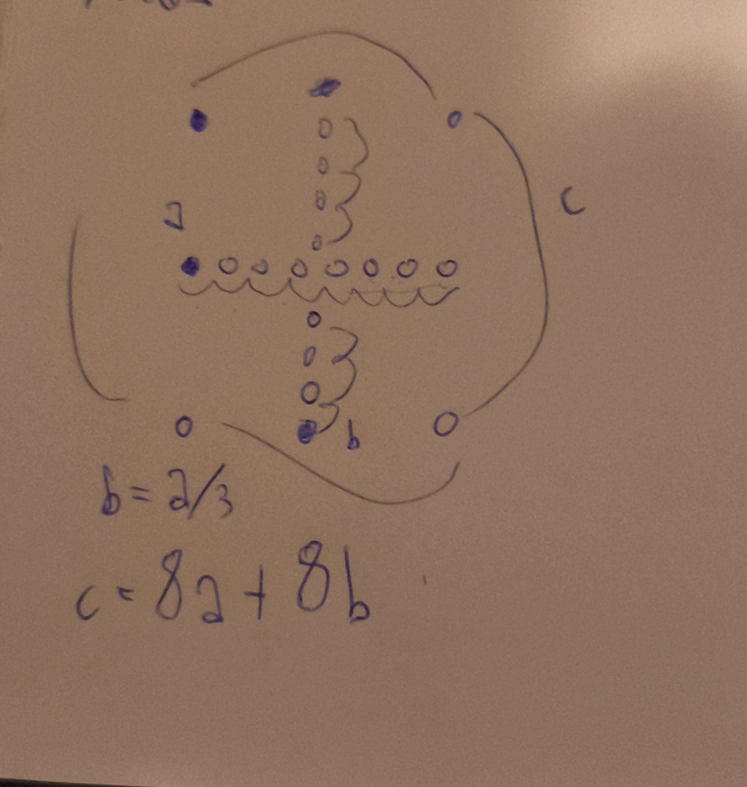
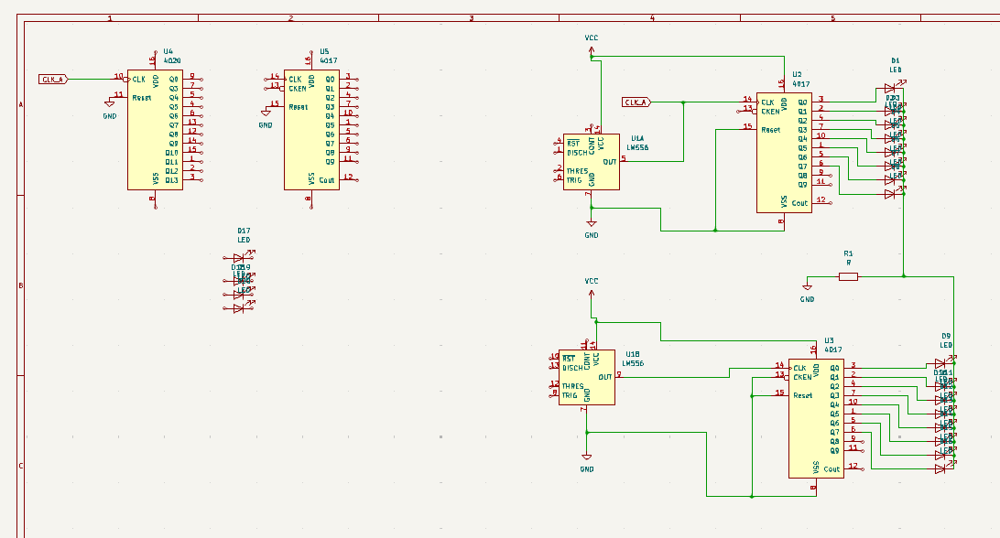

## 2.4.2026
### Time spent: 20 mins
I scrapped my old idea and started working on a completly new one.Firstly i looked up what the lm556 is and how i could use it, its basically 2 ne555s in one package, so i based my idea on 2 main frequencies. A crosshair of 8 (16 total) Leds + 4 leds in the corners, with frequencies as in the image. Since we have the main part i picked 2 cd4017 to drive the 16 leds i didnt have to research anything since i used it before. I will also most likely use a cd4020 for frequency C, and i will most likely change the frequencies(probably b and c so the cd4020 can handle tha math)  

  

> So far i have put the lm556 inside my kicad schematic, but its weird it is 2 symbols with either unit a or b markings. I also imported the cd4017 for both parts(a + b), and wired up the gnds and vccs, and outputs of both parts to their own cd4017  

## 2.4.2026 #2
### Time spent: 30 mins
I wired up the 2 cd4017s to the leds, and their reset and clk enable pins to GND. I connected the cathodes of the 16 leds to ground through a resistor(i will calculate the value later). I also added a cd4020 and another cd4017 to the schematic and wired the reset pins of both Ics to GND, and added a label for clock A and put the label to Lm556s part A and cd4020 clk so they are connected, i will need to do math to figure out the correct speed. Now a big thing i need to decide if i want the leds of the crosshair to go d1-d2........d8-d7-d6....  , or not. If i would choose the first option i would need to either lower the amount of leds to 6 so i could use the existing cd4017 or use an extra cd4017 but i dont think that would be efficient enough idk tho. That decision is for after i wake up since its a bit past midnight already.
  