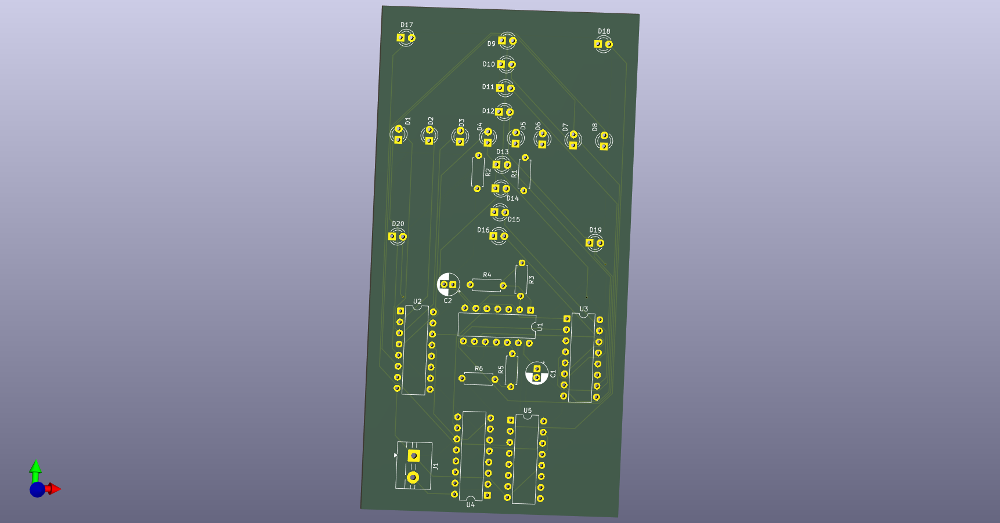
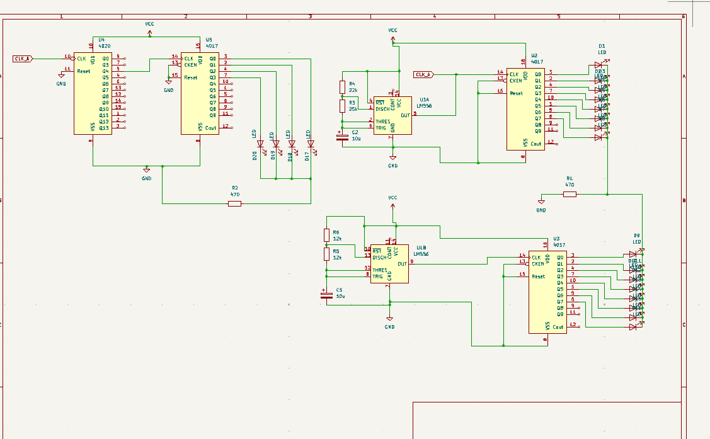

# Resolution-week_3-Hardware
A cross made up of 16 leds with another 4 leds, one for each corner. I made this becouse i wanted to use the cd4020 and lm556 for the first time, and also create a good looking circuit.

#### Render:

#### Schematic:

#### KiCanvas:  
<a href="https://kicanvas.org/?repo=https%3A%2F%2Fgithub.com%2Fsagrusea%2FResolution-week_3-Hardware%2Ftree%2Fmain%2Fsrc%2FKiCad">link</a>